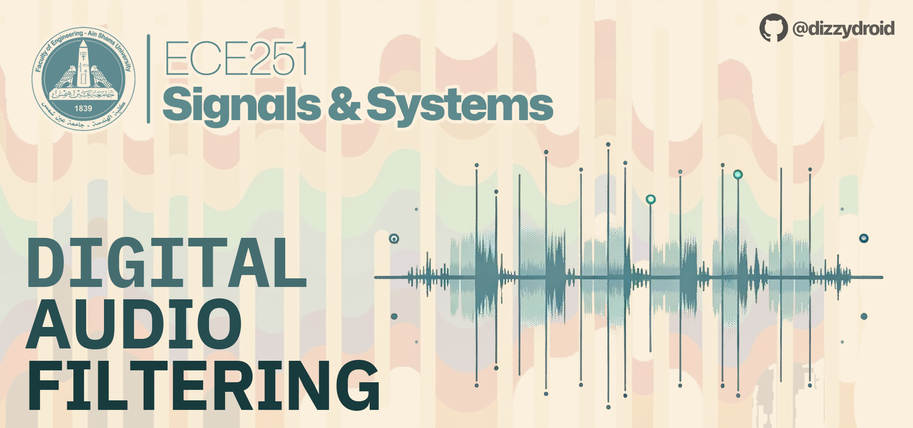

# 🎵 Audio Filtering Project

 

## Overview
👉 This project focuses on developing a code that filters an audio file from the computer’s disk. It plots the audio signal in both time and frequency domains for both the input and output signals.

### Features
- 📁 Read an audio file from the hard disk.
- 📊 Plot the audio signal in the time domain.
- 🌐 Represent and plot the audio signal in the frequency domain.
- 🔊 Apply a filter (either a Low-Pass Filter or High-Pass Filter) to modify the frequency components.
- 📈 Plot the filtered signal in the frequency domain.
- 💾 Save the filtered signal in the time domain as an audio file on the hard disk.

## Repository Contents
- `audio_filter.py` - The main Python script for audio filtering.
- `Audio_Filtering.ipynb` - Jupyter Notebook with detailed documentation and plots.
- `Documentation.pdf` - Project documentation.

## Usage
👩‍💻 The Python script can be accessed [here](audio_filter.py). For a detailed explanation and visualization, refer to the [Jupyter Notebook](Audio_Filtering.ipynb).
> [!NOTE]
<i>The `input.wav` file is <b>not</b> included in this repo, you should provide one to run the script, otherwise you could just check the outputs of our tested Notebook.</i>

## Dependencies
- Numpy
- Matplotlib
- SciPy

## Demonstration
🎥 A video presentation of the filter in action is available (<b>AR</b>) in the attached [documentation](Documentation.pdf)

## References
- [SciPy Documentation](https://docs.scipy.org/)
- [Scipy Signal Butter Function](https://docs.scipy.org/doc/scipy/reference/generated/scipy.signal.butter.html)

## Team Members
- [dizzydroid](https://github.com/dizzydroid)
- [DopeBiscuit](https://github.com/DopeBiscuit)
- [Youssef9112](https://github.com/Youssef9112)
- [seifelwarwary](https://github.com/seifelwarwary)
- [OmarMamon20](https://github.com/OmarMamon20)

## License
📜 [MIT License](LICENSE)

## Contact
💬 For any queries, feel free to reach out!
